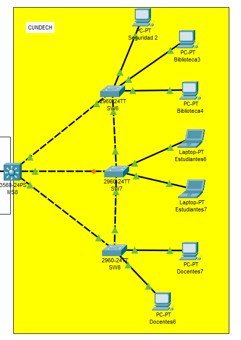
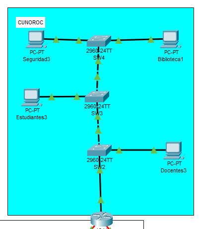
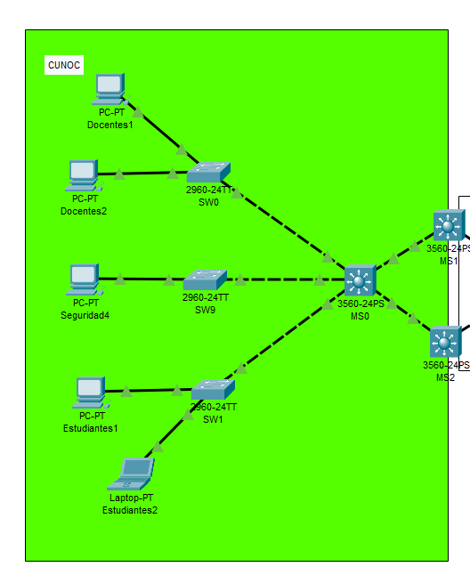
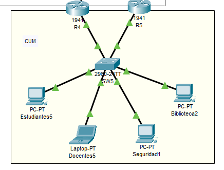
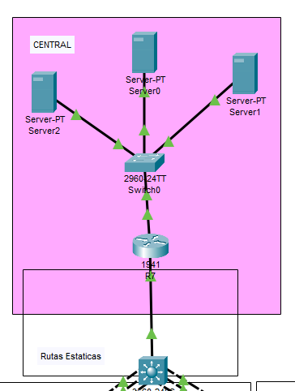
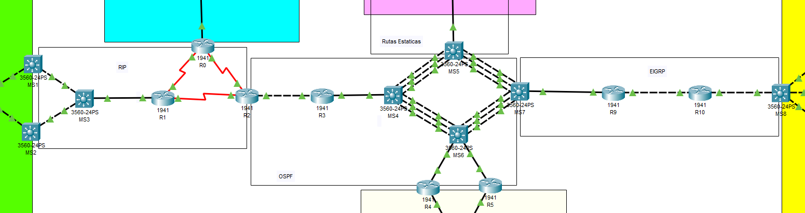

# Manual Tecnico

## Direcciones IP y VLANs

### Parametros Base

- **Grupo**: 09
- **Carnets**: 202110509, 202103206
- **IP del servidor**: 5 ( 9 + 6 = 15)


## SEDES

### CUNDECH(Chimaltenango)

**Red**: 192.128.09.0/24
**Metodo**: VLSM
**Mascara**: 255.255.255.0

| VLAN           |    ID     |  Equipos  |   Host    |   Subred         |  Marcara  |  Primer Host        | Ultimo Host    |
|----------------|-----------|-----------|-----------|------------------|-----------|---------------------|----------------|
| Estudiantes    |    15     |    50     |    62     |  192.168.9.128   |    /26    |   192.168.9.129     | 192.168.9.190  |
| Docentes       |    25     |    20     |    30     |  192.168.9.192   |    /27    |   192.168.9.193     | 192.168.9.222  |
| Seguridad      |    35     |     5     |     6     |  192.168.9.224   |    /29    |   192.168.9.225     | 192.168.9.230  |
| Biblioteca     |    45     |    100    |    126    |  192.168.9.0     |    /25    |   192.168.9.1       | 192.168.9.126  |


### CUNOROC(Huehuetenango)

**Red**: 192.148.9.0/24
**Metodo**: VLSM
**Mascara**: 255.255.255.0

| VLAN           |    ID     |  Equipos  |   Host    |   Subred         |  Marcara  |  Primer Host        | Ultimo Host    |
|----------------|-----------|-----------|-----------|------------------|-----------|---------------------|----------------|
| Estudiantes    |    15     |    45     |    62     |  192.148.9.128   |    /26    |   192.148.9.129     | 192.148.9.190  |
| Docentes       |    25     |    25     |    30     |  192.148.9.192   |    /27    |   192.148.9.193     | 192.148.9.222  |
| Seguridad      |    35     |    10     |    14     |  192.148.9.224   |    /28    |   192.148.9.225     | 192.148.9.238  |
| Biblioteca     |    45     |    75     |    126    |  192.148.9.0     |    /25    |   192.148.9.1       | 192.148.9.126  |


### CUNOC

**Red**: 172.16.9.0
**Metodo**: VLSM
**Mascara**: 255.255.255.0

| VLAN           |    ID     |  Equipos  |   Host    |   Subred         |  Marcara  |  Primer Host        | Ultimo Host    |
|----------------|-----------|-----------|-----------|------------------|-----------|---------------------|----------------|
| Estudiantes    |    15     |    60     |    62     |  172.16.9.0      |    /26    |   172.16.9.1        | 172.16.9.62    |
| Docentes       |    25     |    35     |    62     |  172.16.9.64     |    /26    |   172.16.9.65       | 172.16.9.126   |
| Seguridad      |    35     |    5      |    6      |  172.16.9.192    |    /29    |   172.16.9.193      | 172.16.9.198   |
| Biblioteca     |    45     |    50     |    62     |  172.16.9.128    |    /26    |   172.16.9.129      | 172.16.9.129   |


### Sede Central

**Metodo**: FLSM
**Mascara**: 255.255.255.0

| VLAN        | ID  | Equipos | IP Address         | MáscarGateway |
|-------------|-----|---------|--------------------|---------------|
| Server0     | 55  | 60      | 192.120.9.2        | 192.120.9.1   |
| Server1     | 65  | 35      | 192.121.9.2        | 192.121.9.1   |
| Server2     | 75  | 5       | 192.122.9.2        | 192.122.9.1   |


### CUM(Metropolitano)

**Red**: 192.158.09.0
**Metodo**: VLSM
**Mascara**: 255.255.255.0

| VLAN           |    ID     |  Equipos  |   Host    |   Subred         |  Marcara  |  Primer Host        | Ultimo Host    |
|----------------|-----------|-----------|-----------|------------------|-----------|---------------------|----------------|
| Estudiantes    |    15     |    45     |    62     |  192.158.9.128   |    /26    |   192.158.9.129     | 192.158.9.190  |
| Docentes       |    25     |    25     |    30     |  192.158.9.192   |    /27    |   192.158.9.192     | 172.16.9.222   |
| Seguridad      |    35     |    10     |    14     |  192.158.9.224   |    /28    |   192.158.9.225     | 172.16.9.238   |
| Biblioteca     |    45     |    75     |    126    |  192.158.9.0     |    /25    |   192.158.9.1       | 172.16.9.126   |


### Backbone / CORE
**Red base:** `10.0.0.0`  
**Método:** FLSM
***Máscara:** 255.255.255.0

Enlaces punto a punto usan **/30** (4 direcciones):

|   Host    |   Subred         |  Marcara  |  Primer Host        | Ultimo Host    |
|-----------|------------------|-----------|---------------------|----------------|
|    2      |  10.0.0.0        |    /30    |   10.0.0.1          | 10.0.0.2       |

### Protocolos de Enrutamiento
- **RIP**: Entre CUNOC y CUNOROC
- **OSPF**: Zona metropolitana, con redistribución
- **EIGRP**: Conexión CUM ↔ CUNDECH
- **Estáticas**: Central ↔ MS5


## TOPOLOGIAS

### Topologia CUNDECH



### Topologia CUNOROC



### Topologia CUNOC



### Topologia CUM




### Topologia CENTRAL




### Topologia BACKBONE




## COMANDOS UTILIZIADOS

### Comandos de configuracion CENTRAL

#### SERVERS

```bash
enable
configure terminal
hostname R7

interface g0/1.55
encapsulation dot1Q 55
ip address 192.120.9.1 255.255.255.0
exit

interface g0/1.65
encapsulation dot1Q 65
ip address 192.121.9.1 255.255.255.0
exit

interface g0/1.75
encapsulation dot1Q 75
ip address 192.122.9.1 255.255.255.0
exit

interface g0/1
no shutdown
exit 
```

#### SW0

```bash
enable
configure terminal
hostname Switch0

vlan 55
name Server0
exit
vlan 65
name Server1
exit
vlan 75
name Server2
exit

interface g0/1
switchport trunk encapsulation dot1q
switchport mode trunk
switchport trunk allowed vlan 55,65,75
exit

interface fa0/12
switchport mode access
switchport access vlan 55
exit

interface fa0/11
switchport mode access
switchport access vlan 65
exit

interface fa0/13
switchport mode access
switchport access vlan 75
exit
```

### Comandos de configuracion CUM

### R4

```bash
enable
configure terminal
hostname R4

interface g0/0.15
encapsulation dot1Q 15
ip address 192.158.9.130 255.255.255.192
standby 15 ip 192.158.9.129
standby 15 priority 110
standby 15 preempt
no shutdown
exit

interface g0/0.25
encapsulation dot1Q 25
ip address 192.158.9.194 255.255.255.224
standby 25 ip 192.158.9.193
standby 25 priority 110
standby 25 preempt
no shutdown
exit

interface g0/0.35
encapsulation dot1Q 35
ip address 192.158.9.226 255.255.255.240
standby 35 ip 192.158.9.225
standby 35 priority 110
standby 35 preempt
no shutdown
exit

interface g0/0.45
encapsulation dot1Q 45
ip address 192.158.9.2 255.255.255.128
standby 45 ip 192.158.9.1
standby 45 priority 110
standby 45 preempt
no shutdown
exit

interface g0/0
no shutdown
exit
```

#### R5

```bash
enable
configure terminal
hostname R5

interface g0/0.15
encapsulation dot1Q 15
ip address 192.158.9.131 255.255.255.192
standby 15 ip 192.158.9.129
standby 15 priority 100
standby 15 preempt
no shutdown
exit

interface g0/0.25
encapsulation dot1Q 25
ip address 192.158.9.195 255.255.255.224
standby 25 ip 192.158.9.193
standby 25 priority 100
standby 25 preempt
no shutdown
exit

interface g0/0.35
encapsulation dot1Q 35
ip address 192.158.9.227 255.255.255.240
standby 35 ip 192.158.9.225
standby 35 priority 100
standby 35 preempt
no shutdown
exit

interface g0/0.45
encapsulation dot1Q 45
ip address 192.158.9.3 255.255.255.128
standby 45 ip 192.158.9.1
standby 45 priority 100
standby 45 preempt
no shutdown
exit

interface g0/0
no shutdown
exit    
```

#### SW5

```bash
enable
configure terminal
hostname SW5

vlan 15
name Estudiantes
exit
vlan 25
name Docentes
exit
vlan 35
name Seguridad
exit
vlan 45
name Biblioteca
exit

interface fa0/11
switchport mode access
switchport access vlan 15
exit

interface fa0/12
switchport mode access
switchport access vlan 25
exit

interface fa0/13
switchport mode access
switchport access vlan 35
exit

interface fa0/14
switchport mode access
switchport access vlan 45
exit


interface g0/1
switchport mode trunk
switchport trunk allowed vlan 15,25,35,45
exit

interface g0/2
switchport mode trunk
switchport trunk allowed vlan 15,25,35,45
exit
```

### Comandos de configuracion CUNDECH

#### MS8

```bash
enable
configure terminal
hostname MS8

ip routing  

interface vlan 45
ip address 192.168.9.1 255.255.255.128
no shutdown
exit

interface vlan 15
ip address 192.168.9.129 255.255.255.192
no shutdown
exit

interface vlan 25
ip address 192.168.9.193 255.255.255.224
no shutdown
exit

interface vlan 35
ip address 192.168.9.225 255.255.255.248
no shutdown
exit


interface fa0/2
switchport trunk encapsulation dot1q
switchport mode trunk
switchport trunk allowed vlan 15,25,35,45
exit
```

#### SW6 - SW8

```bash
SW6

enable
configure terminal

vtp domain Grupo09
vtp mode client
vtp password usac2025
exit

configure terminal
interface range fa0/11
switchport mode access
switchport access vlan 35
exit

interface range fa0/12 - 13
switchport mode access
switchport access vlan 45
exit

interface fa0/2
switchport mode trunk
switchport trunk allowed vlan 15,25,35,45
exit


SW8

enable
configure terminal

vtp domain Grupo09
vtp mode client
vtp password usac2025
exit

configure terminal
interface range fa0/11-12
switchport mode access
switchport access vlan 25
exit


interface fa0/2
switchport mode trunk
switchport trunk allowed vlan 15,25,35,45
exit    
```

#### SW7

```bash
enable
configure terminal
hostname SW7

vtp domain Grupo09
vtp mode server
vtp password usac2025


vlan 15
name Estudiantes
exit
vlan 25
name Docentes
exit
vlan 35
name Seguridad
exit
vlan 45
name Biblioteca
exit

interface range fa0/1-3
switchport mode trunk
switchport trunk allowed vlan 15,25,35,45
exit
```

### Comandos de configuracion CUNOC

#### MS0

```bash
enable
configure terminal
hostname MS0

vtp domain Grupo09
vtp mode server
vtp password usac2025

vlan 15
name Estudiantes
exit
vlan 25
name Docentes
exit
vlan 35
name Seguridad
exit
vlan 45
name Biblioteca
exit

interface range fa0/1-5
switchport trunk encapsulation dot1q
switchport mode trunk
switchport trunk allowed vlan 15,25,35,45
exit
```

#### MS1

```bash
enable
configure terminal
hostname MS1

vtp domain Grupo09
vtp mode client
vtp password usac2025

ip routing

interface vlan 15
ip address 172.16.9.2 255.255.255.192
standby 15 ip 172.16.9.1
standby 15 priority 110
standby 15 preempt
no shutdown
exit

interface vlan 25
ip address 172.16.9.130 255.255.255.192
standby 25 ip 172.16.9.129
standby 25 priority 110
standby 25 preempt
no shutdown
exit

interface vlan 35
ip address 172.16.9.194 255.255.255.248
standby 35 ip 172.16.9.193
standby 35 priority 110
standby 35 preempt
no shutdown
exit

interface vlan 45
ip address 172.16.9.66 255.255.255.192
standby 45 ip 172.16.9.65
standby 45 priority 110
standby 45 preempt
no shutdown
exit

interface range fa0/1-2
switchport trunk encapsulation dot1q
switchport mode trunk
switchport trunk allowed vlan 15,25,35,45
exit
```

#### MS2

```bash
enable
configure terminal
hostname MS2

vtp domain Grupo09
vtp mode client
vtp password usac2025

ip routing

interface vlan 15
ip address 172.16.9.3 255.255.255.192
standby 15 ip 172.16.9.1
standby 15 priority 100
standby 15 preempt
no shutdown
exit

interface vlan 25
ip address 172.16.9.131 255.255.255.192
standby 25 ip 172.16.9.129
standby 25 priority 100
standby 25 preempt
no shutdown
exit

interface vlan 35
ip address 172.16.9.195 255.255.255.248
standby 35 ip 172.16.9.193
standby 35 priority 100
standby 35 preempt
no shutdown
exit

interface vlan 45
ip address 172.16.9.67 255.255.255.192
standby 45 ip 172.16.9.65
standby 45 priority 100
standby 45 preempt
no shutdown
exit

interface range fa0/1-2
switchport trunk encapsulation dot1q
switchport mode trunk
switchport trunk allowed vlan 15,25,35,45
exit
```

#### SW0 - SW1 - SW9

```bash
SW0

enable
configure terminal
hostname SW0

vtp domain Grupo09
vtp mode client
vtp password usac2025

interface range fa0/11-12
switchport mode access
switchport access vlan 25
exit


-------------------------------

SW9

enable
configure terminal
hostname SW9

vtp domain Grupo09
vtp mode client
vtp password usac2025

interface fa0/11
switchport mode access
switchport access vlan 35
exit


-------------------------------

SW1

enable
configure terminal
hostname SW1

vtp domain Grupo09
vtp mode client
vtp password usac2025

interface range fa0/11-12
switchport mode access
switchport access vlan 15
exit
```

### Comandos de configuracion CUNOROC

#### R0

```bash
enable
configure terminal

interface g0/0.15
encapsulation dot1Q 15
ip address 192.148.9.129 255.255.255.192
exit

interface g0/0.25
encapsulation dot1Q 25
ip address 192.148.9.193 255.255.255.224
exit

interface g0/0.35
encapsulation dot1Q 35
ip address 192.148.9.225 255.255.255.240
exit

interface g0/0.45
encapsulation dot1Q 45
ip address 192.148.9.1 255.255.255.128
exit

interface g0/0
no shutdown
exit

```

#### SW2

```bash
enable
configure terminal
hostname SW2

vtp domain Grupo09
vtp mode client
vtp password usac2025

interface g0/1
switchport mode trunk
switchport trunk allowed vlan 15,25,35,45
exit

interface fa0/1 
switchport mode trunk
switchport trunk allowed vlan 15,25,35,45
exit

interface fa0/11
switchport mode access
switchport access vlan 25
exit    
```

#### SW3

```bash
enable
configure terminal
hostname SW3

vtp domain Grupo09
vtp mode server
vtp password usac2025

vlan 15
name Estudiantes
exit

vlan 25
name Docentes
exit

vlan 35
name Seguridad
exit

vlan 45
name Biblioteca
exit


interface range fa0/1-2
switchport mode trunk
switchport trunk allowed vlan 15,25,35,45
exit

interface fa0/11
switchport mode access
switchport access vlan 15
exit
```

#### SW4

```bash
enable
configure terminal
hostname SW4

vtp domain Grupo09
vtp mode client
vtp password usac2025

interface fa0/1 
switchport mode trunk
switchport trunk allowed vlan 15,25,35,45
exit

interface fa0/11
switchport mode access
switchport access vlan 45
exit

interface fa0/12
switchport mode access
switchport access vlan 35
exit
```

### Comandos de configuracion EIGRP

#### MS7

```bash
enable
configure terminal

interface GigabitEthernet0/1
 no switchport
 ip address 10.0.0.89 255.255.255.252
 no shutdown
exit

router eigrp 90
 network 10.0.0.88 0.0.0.3
 no auto-summary
exit

router ospf 1
 redistribute eigrp 90 subnets
exit

router eigrp 90
 redistribute ospf 1 metric 10000 100 255 1 1500
exit
```

#### MS8

```bash
enable
configure terminal

interface GigabitEthernet0/1
 no switchport
 ip address 10.0.0.98 255.255.255.252
 no shutdown
exit

ip routing

router eigrp 90
 network 10.0.0.96 0.0.0.3
 network 192.168.9.0 0.0.0.127     
 network 192.168.9.128 0.0.0.63      
 network 192.168.9.192 0.0.0.31      
 network 192.168.9.224 0.0.0.15     
 no auto-summary
exit

interface vlan 15
 ip address 192.168.9.129 255.255.255.192
 no shutdown
exit

interface vlan 25
 ip address 192.168.9.193 255.255.255.224
 no shutdown
exit

interface vlan 35
 ip address 192.168.9.225 255.255.255.240
 no shutdown
exit

interface vlan 45
 ip address 192.168.9.1 255.255.255.128
 no shutdown
exit

interface fa0/2
switchport trunk encapsulation dot1q
switchport mode trunk
switchport trunk allowed vlan 15,25,35,45
no shutdown
exit

vlan 15
exit
vlan 25
exit
vlan 35
exit
vlan 45
exit
```

#### R9

```bash
enable 
configure terminal 

interface GigabitEthernet0/0
 ip address 10.0.0.90 255.255.255.252
 no shutdown
exit

interface GigabitEthernet0/1
 ip address 10.0.0.93 255.255.255.252
 no shutdown
exit

router eigrp 90
 network 10.0.0.88 0.0.0.3
 network 10.0.0.92 0.0.0.3
 no auto-summary
exit
```

#### R10

```bash
enable
configure terminal

interface GigabitEthernet0/0
 ip address 10.0.0.94 255.255.255.252
 no shutdown
exit

interface GigabitEthernet0/1
 ip address 10.0.0.97 255.255.255.252
 no shutdown
exit

router eigrp 90
 network 10.0.0.92 0.0.0.3
 network 10.0.0.96 0.0.0.3
 no auto-summary
exit
```

#### SW7

```bash
enable
configure terminal

interface FastEthernet0/1 
 switchport mode trunk
 switchport trunk allowed vlan 15,25,35,45
 no shutdown
exit
```

### Comandos de configuracion OSPF

#### MS4

```bash
enable
configure terminal

interface GigabitEthernet0/1
 no switchport
 ip address 10.0.0.30 255.255.255.252
 no shutdown
exit

ip routing

router ospf 1
 network 10.0.0.28 0.0.0.3 area 0
exit


interface FastEthernet0/1
 no switchport
 ip address 10.0.0.33 255.255.255.252
 no shutdown
exit

router ospf 1
 network 10.0.0.32 0.0.0.3 area 0
exit


interface FastEthernet0/2
 no switchport
 ip address 10.0.0.37 255.255.255.252
 no shutdown
exit

router ospf 1
 network 10.0.0.36 0.0.0.3 area 0
exit


interface FastEthernet0/3
 no switchport
 ip address 10.0.0.41 255.255.255.252
 no shutdown
exit

router ospf 1
 network 10.0.0.40 0.0.0.3 area 0
exit


----

interface FastEthernet0/4
no switchport
ip address 10.0.0.45 255.255.255.252
no shutdown
exit

router ospf 1
network 10.0.0.44 0.0.0.3 area 0
exit

interface FastEthernet0/5
no switchport
ip address 10.0.0.49 255.255.255.252
no shutdown
exit

router ospf 1
network 10.0.0.48 0.0.0.3 area 0
exit

interface FastEthernet0/6
no switchport
ip address 10.0.0.53 255.255.255.252
no shutdown
exit

router ospf 1
network 10.0.0.52 0.0.0.3 area 0
exit    
```

#### MS5

```bash
enable
configure terminal

interface FastEthernet0/1
 no switchport
 ip address 10.0.0.34 255.255.255.252
 no shutdown
exit

ip routing

router ospf 1
 network 10.0.0.32 0.0.0.3 area 0
exit

interface FastEthernet0/2
 no switchport
 ip address 10.0.0.38 255.255.255.252
 no shutdown
exit

router ospf 1
 network 10.0.0.36 0.0.0.3 area 0
exit

interface FastEthernet0/3
 no switchport
 ip address 10.0.0.42 255.255.255.252
 no shutdown
exit

router ospf 1
 network 10.0.0.40 0.0.0.3 area 0
exit

interface FastEthernet0/4
no switchport
ip address 10.0.0.57 255.255.255.252
no shutdown
exit

router ospf 1
network 10.0.0.56 0.0.0.3 area 0
exit

interface FastEthernet0/5
no switchport
ip address 10.0.0.61 255.255.255.252
no shutdown
exit

router ospf 1
network 10.0.0.60 0.0.0.3 area 0
exit

interface FastEthernet0/6
no switchport
ip address 10.0.0.65 255.255.255.252
no shutdown
exit

router ospf 1
network 10.0.0.64 0.0.0.3 area 0
exit
```

#### MS6

```bash
enable
configure terminal
ip routing

interface FastEthernet0/1
no switchport
ip address 10.0.0.46 255.255.255.252
no shutdown
exit

router ospf 1
network 10.0.0.44 0.0.0.3 area 0
exit

interface FastEthernet0/2
no switchport
ip address 10.0.0.50 255.255.255.252
no shutdown
exit

router ospf 1
network 10.0.0.48 0.0.0.3 area 0
exit

interface FastEthernet0/3
no switchport
ip address 10.0.0.54 255.255.255.252
no shutdown
exit

router ospf 1
network 10.0.0.52 0.0.0.3 area 0
exit

interface FastEthernet0/4
no switchport
ip address 10.0.0.69 255.255.255.252
no shutdown
exit

router ospf 1
network 10.0.0.68 0.0.0.3 area 0
exit

interface FastEthernet0/5
no switchport
ip address 10.0.0.73 255.255.255.252
no shutdown
exit

router ospf 1
network 10.0.0.72 0.0.0.3 area 0
exit

interface FastEthernet0/6
no switchport
ip address 10.0.0.77 255.255.255.252
no shutdown
exit

router ospf 1
network 10.0.0.76 0.0.0.3 area 0
exit


interface GigabitEthernet0/1
no switchport
ip address 10.0.0.81 255.255.255.252
no shutdown
exit

router ospf 1
network 10.0.0.80 0.0.0.3 area 0
exit

interface GigabitEthernet0/2
no switchport
ip address 10.0.0.85 255.255.255.252
no shutdown
exit

router ospf 1
network 10.0.0.84 0.0.0.3 area 0
exit    
```

#### MS7

```bash
enable
configure terminal
ip routing

interface FastEthernet0/1
no switchport
ip address 10.0.0.58 255.255.255.252
no shutdown
exit

router ospf 1
network 10.0.0.56 0.0.0.3 area 0
exit

interface FastEthernet0/2
no switchport
ip address 10.0.0.62 255.255.255.252
no shutdown
exit

router ospf 1
network 10.0.0.60 0.0.0.3 area 0
exit

interface FastEthernet0/3
no switchport
ip address 10.0.0.66 255.255.255.252
no shutdown
exit

router ospf 1
network 10.0.0.64 0.0.0.3 area 0
exit


interface FastEthernet0/4
no switchport
ip address 10.0.0.70 255.255.255.252
no shutdown
exit

router ospf 1
network 10.0.0.68 0.0.0.3 area 0
exit

interface FastEthernet0/5
no switchport
ip address 10.0.0.74 255.255.255.252
no shutdown
exit

router ospf 1
network 10.0.0.72 0.0.0.3 area 0
exit

interface FastEthernet0/6
no switchport
ip address 10.0.0.78 255.255.255.252
no shutdown
exit

router ospf 1
network 10.0.0.76 0.0.0.3 area 0
exit
```

#### R2

```bash
enable
configure terminal

interface GigabitEthernet0/0
 ip address 10.0.0.25 255.255.255.252
 no shutdown
exit

router ospf 1
 network 10.0.0.24 0.0.0.3 area 0
exit


router rip
 redistribute ospf 1 metric 1
exit

router ospf 1
 redistribute rip subnets
exit
```

#### R3

```bash
enable
configure terminal

interface GigabitEthernet0/0
 ip address 10.0.0.26 255.255.255.252
 no shutdown
exit

router ospf 1
 network 10.0.0.24 0.0.0.3 area 0
exit

interface GigabitEthernet0/1
 ip address 10.0.0.29 255.255.255.252
 no shutdown
exit

router ospf 1
 network 10.0.0.28 0.0.0.3 area 0
exit
```

#### R4

```bash
enable
configure terminal
interface GigabitEthernet0/1
ip address 10.0.0.82 255.255.255.252
no shutdown
exit

router ospf 1
network 10.0.0.80 0.0.0.3 area 0
network 192.158.9.128 0.0.0.63 area 0  
network 192.158.9.192 0.0.0.31 area 0  
network 192.158.9.224 0.0.0.15 area 0  
network 192.158.9.0 0.0.0.127 area 0  
exit    
```

#### R5

```bash
enable
configure terminal

interface GigabitEthernet0/1
ip address 10.0.0.86 255.255.255.252
no shutdown
exit

router ospf 1
network 10.0.0.84 0.0.0.3 area 0
 network 192.158.9.128 0.0.0.63 area 0  
 network 192.158.9.192 0.0.0.31 area 0  
 network 192.158.9.224 0.0.0.15 area 0  
 network 192.158.9.0 0.0.0.127 area 0   
exit
```


### Comandos de configuracion RIP

#### MS1

```bash
enable
configure terminal

interface FastEthernet0/1
no switchport
ip address 10.0.0.13 255.255.255.252
no shutdown
exit

ip routing

router rip
version 2
no auto-summary
network 10.0.0.0
network 172.16.9.0
exit
```

#### MS2

```bash
enable
configure terminal

interface FastEthernet0/1
no switchport
ip address 10.0.0.17 255.255.255.252
no shutdown
exit

ip routing

router rip
version 2
no auto-summary
network 10.0.0.0
network 172.16.9.0
exit
```

#### MS3

```bash
enable
configure terminal

interface GigabitEthernet0/1
 no switchport
 ip address 10.0.0.22 255.255.255.252
 no shutdown
exit

interface FastEthernet0/1
 no switchport
 ip address 10.0.0.14 255.255.255.252
 no shutdown
exit

interface FastEthernet0/2
 no switchport
 ip address 10.0.0.18 255.255.255.252
 no shutdown
exit

ip routing

router rip
 version 2
 no auto-summary
 network 10.0.0.0

exit    
```

#### R0

```bash
enable
configure terminal

interface Serial0/0/0
ip address 10.0.0.5 255.255.255.252
clock rate 64000
no shutdown
exit

interface Serial0/0/1
ip address 10.0.0.1 255.255.255.252
no shutdown
exit

router rip
version 2
no auto-summary
network 10.0.0.0
network 192.148.9.0 
exit
```

#### R1

```bash
enable
configure terminal

interface Serial0/0/0
 ip address 10.0.0.2 255.255.255.252
 clock rate 64000
 no shutdown
exit

interface Serial0/0/1
 ip address 10.0.0.9 255.255.255.252
 no shutdown
exit

interface GigabitEthernet0/0
 ip address 10.0.0.21 255.255.255.252
 no shutdown
exit

router rip
 version 2
 no auto-summary
 network 10.0.0.0
exit
```

#### R2

```bash
enable
configure terminal

interface Serial0/0/0
ip address 10.0.0.6 255.255.255.252
no shutdown
exit

interface Serial0/0/1
ip address 10.0.0.10 255.255.255.252
clock rate 64000
no shutdown
exit

router rip
version 2
no auto-summary
network 10.0.0.0
network 192.148.9.0
exit    
```

#### MS5

```bash
enable
configure terminal

interface GigabitEthernet0/1
 no switchport
 ip address 10.0.0.89 255.255.255.252
 no shutdown
exit

ip routing

ip route 192.121.9.0 255.255.255.0 10.0.0.90
ip route 192.122.9.0 255.255.255.0 10.0.0.90
ip route 192.123.9.0 255.255.255.0 10.0.0.90
exit    
```

#### R7

```bash
enable
configure terminal


interface GigabitEthernet0/0
 ip address 10.0.0.90 255.255.255.252
 no shutdown
exit


interface GigabitEthernet0/1.1
 encapsulation dot1Q 1
 ip address 192.121.9.1 255.255.255.0
 no shutdown
exit

interface GigabitEthernet0/1.2
 encapsulation dot1Q 2
 ip address 192.122.9.1 255.255.255.0
 no shutdown
exit

interface GigabitEthernet0/1.3
 encapsulation dot1Q 3
 ip address 192.123.9.1 255.255.255.0
 no shutdown
exit

interface GigabitEthernet0/1
 no shutdown
exit

ip route 0.0.0.0 0.0.0.0 10.0.0.89
exit
```
